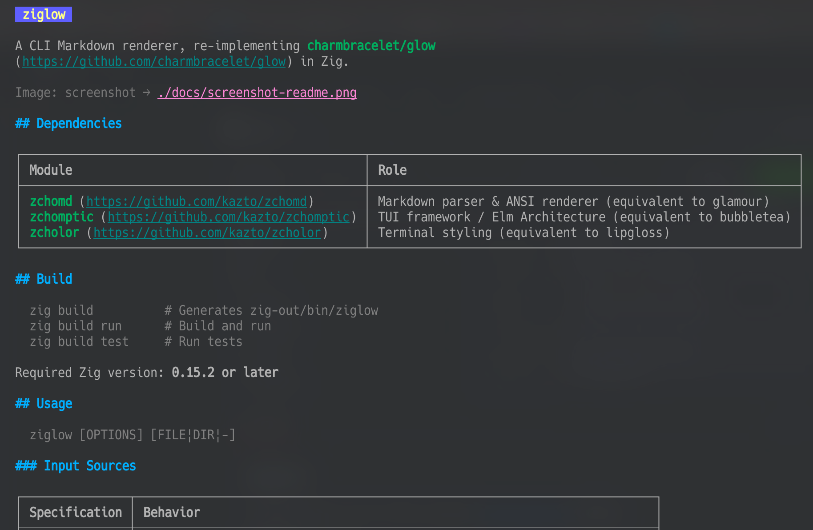

# ziglow

A CLI Markdown renderer, re-implementing [charmbracelet/glow](https://github.com/charmbracelet/glow) in Zig.



## Dependencies

| Module | Role |
|---|---|
| [zchomd](https://github.com/kazto/zchomd) | Markdown parser & ANSI renderer (equivalent to glamour) |
| [zchomptic](https://github.com/kazto/zchomptic) | TUI framework / Elm Architecture (equivalent to bubbletea) |
| [zcholor](https://github.com/kazto/zcholor) | Terminal styling (equivalent to lipgloss) |

## Build

```sh
zig build          # Generates zig-out/bin/ziglow
zig build run      # Build and run
zig build test     # Run tests
```

Required Zig version: **0.15.2 or later**

## Usage

```sh
ziglow [OPTIONS] [FILE|DIR|-]
```

### Input Sources

| Specification | Behavior |
|---|---|
| `FILE` | Renders the specified Markdown file. |
| `DIR` | Searches for `README.md` within the directory and renders it. |
| `-` | Reads from standard input (stdin). |
| (omitted) | Reads from stdin if it's a pipe; otherwise, uses the current directory. |

### Options

| Option | Description | Default |
|---|---|---|
| `-s`, `--style <name>` | Style: `dark` / `light` / `notty` / `auto` | `auto` |
| `-w`, `--width <n>` | Word-wrap width (0 = terminal width, max 120) | Terminal width |
| `-p`, `--pager` | Pipe output to `$PAGER` (defaults to `less -r` if unset) | — |
| `-t`, `--tui` | Use the built-in TUI pager | — |
| `-h`, `--help` | Show help | — |
| `-V`, `--version` | Show version | — |

The `auto` style automatically selects `dark` when outputting to a TTY and `notty` when piped.

## Configuration File

`ziglow` reads a TOML configuration file from the following paths:

- `$XDG_CONFIG_HOME/ziglow/ziglow.toml`
- or `~/.config/ziglow/ziglow.toml`

Command-line options take precedence over values in the configuration file.

### Configuration Items

| Key | Description | Example |
|---|---|---|
| `style` | Default style | `"dark"` / `"light"` / `"notty"` / `"auto"` |
| `width` | Word-wrap width | `100` |
| `pager` | External pager to use | `"less -R"` |
| `builtin_tui` | Whether to use the built-in TUI by default | `true` / `false` |
| `h1_foreground` | Foreground color for H1 | `"#1f1f1f"` / `"228"` |
| `h1_background` | Background color for H1 | `"#a0a0a0"` / `"63"` |
| `h1_scale` | Scale factor for H1 (supported terminals only) | `3.0` |
| `h2_foreground` | Foreground color for H2 | `"#1f1f1f"` |
| `h2_background` | Background color for H2 | `"#a0a0a0"` |
| `h2_scale` | Scale factor for H2 (supported terminals only) | `1.5` |

### Configuration Example

```toml
style = "dark"
width = 100
pager = "less -R"
builtin_tui = false

h1_foreground = "#282c34"
h1_background = "#e06c75"
h1_scale = 3.0

h2_foreground = "#e06c75"
h2_scale = 1.5
```

### Examples

```sh
# Render a file
ziglow README.md

# Show the README in the current directory
ziglow

# Pipe from stdin
cat CHANGELOG.md | ziglow

# Explicitly specify stdin
ziglow -

# Light style with width 60
ziglow -s light -w 60 README.md

# Show using an external pager
ziglow -p README.md

# Show using the built-in TUI pager
ziglow -t README.md
```

## TUI Pager Keybindings

| Key | Action |
|---|---|
| `j` / `↓` | Scroll down one line |
| `k` / `↑` | Scroll up one line |
| `d` / `Ctrl+D` | Scroll down half a page |
| `u` / `Ctrl+U` | Scroll up half a page |
| `f` / `Space` / `Ctrl+F` / `PageDown` | Scroll down one page |
| `b` / `Ctrl+B` / `PageUp` | Scroll up one page |
| `g` / `Home` | Go to top |
| `G` / `End` | Go to bottom |
| `q` / `Ctrl+C` | Quit |

## Project Structure

```
ziglow/
├── build.zig          # Build definition
├── build.zig.zon      # Dependencies (zchomd, zchomptic, zcholor)
└── src/
    ├── main.zig       # CLI entry point, argument parsing, rendering dispatch
    ├── config.zig     # Configuration file loading (TOML) and management
    ├── tui.zig        # TUI pager model (zchomptic)
    ├── mermaid.zig    # Mermaid diagram rendering integration
    ├── termimage.zig  # Terminal image rendering (Sixel/Kitty support)
```
